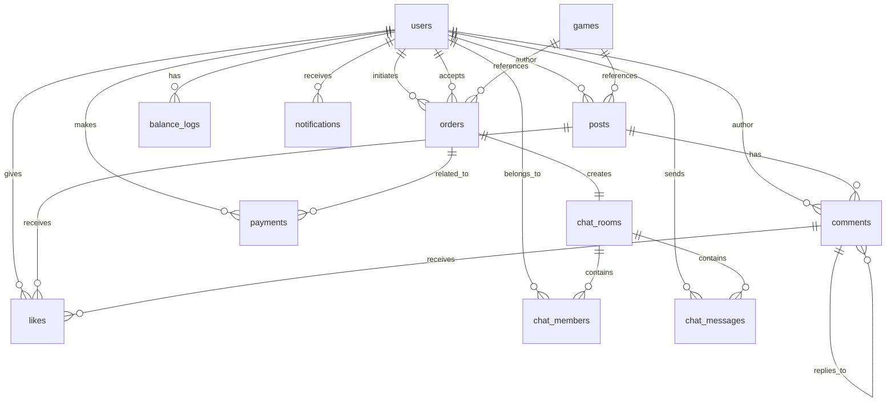

# GameTrust Supabase集成技术文档

## 概述

GameTrust平台已完成与Supabase的深度集成，利用Supabase提供的BaaS（Backend as a Service）功能，实现了高效、安全、可扩展的后端服务架构。本文档详细介绍了Supabase集成的技术实现、数据模型、API接口以及开发指南。

## 技术架构

### 前端架构
- **框架**: Vue 3 + Vite
- **状态管理**: Pinia (集成Supabase Auth)
- **UI组件**: Vant 4 (移动端优化)
- **HTTP客户端**: Axios + Supabase客户端
- **样式预处理**: Sass

### 后端架构
- **API服务**: Node.js + Express
- **数据库**: PostgreSQL (Supabase托管)
- **认证服务**: Supabase Auth
- **实时通信**: Supabase Realtime
- **存储服务**: Supabase Storage (预留)

### 数据库架构
- **主数据库**: PostgreSQL 14+
- **连接池**: Supabase管理
- **行级安全**: RLS (Row Level Security)
- **实时订阅**: Supabase Realtime

## 数据模型设计

### 核心实体关系图



### 表结构说明

#### 用户表 (users)
- `id` (uuid) - 主键，关联Supabase auth.users
- `phone` (varchar, 11) - 手机号，用于登录
- `username` (varchar, 50) - 用户名
- `avatar` (text) - 头像URL
- `rating` (decimal, 5,2) - 信誉评分 (0-5.0)
- `balance` (decimal, 10,2) - 账户余额
- `role` (varchar, 20) - 用户角色 (user/admin)
- `is_verified` (boolean) - 实名认证状态
- `verification_data` (jsonb) - 认证数据

#### 游戏表 (games)
- `id` (uuid) - 主键
- `name` (varchar, 100) - 游戏名称
- `category` (varchar, 50) - 游戏分类
- `description` (text) - 游戏描述
- `image` (text) - 游戏图片URL
- `is_active` (boolean) - 是否启用
- `sort_order` (integer) - 排序

#### 订单表 (orders)
- `id` (uuid) - 主键
- `title` (varchar, 200) - 订单标题
- `description` (text) - 订单描述
- `type` (varchar, 20) - 订单类型 (代练/道具/账号/其他)
- `amount` (decimal, 10,2) - 交易金额
- `guarantee_fee` (decimal, 10,2) - 担保费用
- `urgency_fee` (decimal, 10,2) - 加急费用
- `total_amount` (decimal, 10,2) - 总金额
- `status` (varchar, 20) - 订单状态 (pending/processing/completed/cancelled)
- `deadline` (timestamp) - 完成时限
- `urgency` (integer, 1-5) - 紧急程度
- `estimated_hours` (integer) - 预计工作时长
- `initiator_id` (uuid) - 发起人ID
- `acceptor_id` (uuid) - 接受人ID
- `game_id` (uuid) - 游戏ID

#### 帖子表 (posts)
- `id` (uuid) - 主键
- `content` (text) - 帖子内容
- `type` (varchar, 20) - 帖子类型 (需求/服务/分享)
- `author_id` (uuid) - 作者ID
- `game_id` (uuid) - 游戏ID
- `views` (integer) - 浏览次数
- `likes_count` (integer) - 点赞数
- `comments_count` (integer) - 评论数
- `is_pinned` (boolean) - 是否置顶
- `is_active` (boolean) - 是否活跃

#### 聊天相关表
- `chat_rooms` - 聊天室表
- `chat_members` - 聊天成员表
- `chat_messages` - 聊天消息表

## API接口设计

### 认证API

#### 用户注册
```javascript
// POST /api/auth/register
{
  "email": "user@example.com",
  "phone": "13800138000",
  "password": "password123",
  "username": "用户名"
}
```

#### 用户登录
```javascript
// POST /api/auth/login
{
  "phone": "13800138000",
  "password": "password123"
}
```

#### 短信验证码登录
```javascript
// POST /api/auth/sms-login
{
  "phone": "13800138000",
  "code": "123456"
}
```

### 游戏API

#### 获取游戏列表
```javascript
// GET /api/games
// Response:
{
  "success": true,
  "data": [
    {
      "id": "uuid",
      "name": "王者荣耀",
      "category": "MOBA",
      "description": "热门MOBA手游代练",
      "image": "https://example.com/image.jpg"
    }
  ]
}
```

### 订单API

#### 创建订单
```javascript
// POST /api/orders
{
  "title": "订单标题",
  "description": "订单描述",
  "type": "代练",
  "amount": "100.00",
  "game_id": "uuid",
  "deadline": "2024-02-01T00:00:00Z",
  "urgency": 3
}
```

#### 获取订单列表
```javascript
// GET /api/orders?status=pending&limit=20&offset=0
```

### 帖子API

#### 创建帖子
```javascript
// POST /api/posts
{
  "content": "帖子内容",
  "type": "需求",
  "game_id": "uuid"
}
```

#### 获取帖子列表
```javascript
// GET /api/posts?type=需求&game_id=uuid&limit=20&offset=0
```

## 安全策略

### 行级安全 (Row Level Security)

所有表都启用了RLS，实现了基于用户角色的数据访问控制：

1. **用户表**
   - 用户只能查看和更新自己的信息
   - 管理员可以查看所有用户信息

2. **订单表**
   - 用户只能查看自己参与的订单
   - 管理员可以查看所有订单

3. **聊天表**
   - 用户只能查看自己参与的聊天
   - 管理员可以查看所有聊天

4. **帖子表**
   - 所有用户可以查看帖子
   - 作者和管理员可以编辑/删除自己的帖子

### API安全

1. **JWT认证**
   - 使用Supabase Auth JWT token
   - 自动token刷新机制
   - 过期token自动清除

2. **输入验证**
   - 后端参数验证
   - SQL注入防护（Supabase ORM）
   - XSS防护

3. **权限控制**
   - 基于角色的API访问控制
   - 敏感操作二次确认

## 性能优化

### 数据库优化

1. **索引策略**
   - 用户表: phone索引
   - 订单表: initiator_id, acceptor_id, status复合索引
   - 聊天消息表: room_id, created_at复合索引
   - 帖子表: author_id, game_id, created_at复合索引

2. **查询优化**
   - 使用Supabase select()限制返回字段
   - 避免N+1查询问题
   - 分页查询

### 前端优化

1. **缓存策略**
   - API响应缓存
   - 组件级别缓存
   - 乐观更新

2. **渲染优化**
   - 虚拟滚动处理长列表
   - 图片懒加载
   - 防抖和节流

3. **网络优化**
   - 请求合并
   - 离线请求队列
   - 错误重试机制

## 实时功能

Supabase Realtime可用于实现以下实时功能：

1. **实时聊天**
   ```javascript
   const subscription = supabase
     .channel('chat_room_' + roomId)
     .on('postgres_changes', 
       { event: 'INSERT', schema: 'public', table: 'chat_messages', filter: `room_id=eq.${roomId}` },
       (payload) => {
         // 处理新消息
       }
     )
     .subscribe()
   ```

2. **订单状态更新**
   ```javascript
   const subscription = supabase
     .channel('order_updates')
     .on('postgres_changes',
       { event: 'UPDATE', schema: 'public', table: 'orders' },
       (payload) => {
         // 处理订单状态变更
       }
     )
     .subscribe()
   ```

## 开发指南

### 环境配置

1. **前端环境变量**
   ```env
   VITE_SUPABASE_URL=https://your-project.supabase.co
   VITE_SUPABASE_ANON_KEY=your-anon-key
   ```

2. **后端环境变量**
   ```env
   SUPABASE_URL=https://your-project.supabase.co
   SUPABASE_ANON_KEY=your-anon-key
   SUPABASE_SERVICE_ROLE_KEY=your-service-role-key
   ```

### 使用Supabase客户端

```javascript
import { supabase } from '../supabase'

// 查询数据
const { data, error } = await supabase
  .from('orders')
  .select('*')
  .eq('status', 'pending')

// 插入数据
const { data, error } = await supabase
  .from('posts')
  .insert([{ content: '内容', type: '需求' }])

// 更新数据
const { data, error } = await supabase
  .from('users')
  .update({ username: '新用户名' })
  .eq('id', userId)
```

### 认证使用

```javascript
import { useAuthStore } from '../stores/auth'

const authStore = useAuthStore()

// 登录
const { success, data, error } = await authStore.login({
  phone: '13800138000',
  password: 'password123'
})

// 注册
const { success, data, error } = await authStore.register({
  phone: '13800138000',
  password: 'password123',
  username: '用户名'
})

// 发送短信验证码
const { success, data, error } = await authStore.sendSmsCode('13800138000')
```

### API服务使用

```javascript
import { supabaseApi, apiService } from '../api'

// 使用Supabase直接查询
const games = await supabaseApi.games.getAll()

// 使用后端API
const orders = await apiService.orders.getAll({ status: 'pending' })
```

## 部署指南

### 前端部署

1. 构建生产版本
   ```bash
   npm run build
   ```

2. 部署到静态托管服务（如Vercel、Netlify）
   - 确保环境变量正确配置
   - 设置重定向规则

### 后端部署

1. 安装依赖
   ```bash
   cd api
   npm install
   ```

2. 配置环境变量
   - 设置Supabase连接信息
   - 配置端口和其他服务参数

3. 启动服务
   ```bash
   npm start
   ```

### Supabase配置

1. **RLS策略**
   - 已通过迁移脚本创建
   - 可在Supabase控制台查看和修改

2. **数据库函数和触发器**
   - 已通过迁移脚本创建
   - 可通过SQL编辑器扩展

3. **认证设置**
   - 配置邮件和短信提供商
   - 设置自定义重定向URL

## 监控和日志

### 错误监控

1. **前端错误**
   - 统一错误处理
   - 错误日志收集

2. **API错误**
   - 错误分类和通知
   - 请求日志记录

### 性能监控

1. **API响应时间**
   - 请求时间统计
   - 慢查询分析

2. **前端性能**
   - 页面加载时间
   - 组件渲染性能

## 未来扩展

### 计划功能

1. **实时通知**
   - 使用Supabase Realtime
   - 推送通知集成

2. **文件上传**
   - 集成Supabase Storage
   - 图片和文件管理

3. **数据分析**
   - 用户行为分析
   - 业务指标监控

4. **移动应用**
   - React Native/Flutter
   - 共享Supabase后端

### 扩展策略

1. **微服务化**
   - 服务拆分
   - 独立部署

2. **多租户**
   - 数据隔离
   - 资源配额

3. **国际化**
   - 多语言支持
   - 地区定制

## 总结

通过Supabase的集成，GameTrust平台实现了：

1. **高效开发**
   - 快速原型开发
   - 减少后端开发工作量

2. **安全可靠**
   - 企业级安全策略
   - 数据隔离和权限控制

3. **性能优化**
   - 数据库优化
   - 前端渲染优化

4. **可扩展性**
   - 模块化设计
   - 易于功能扩展

5. **实时能力**
   - 实时数据同步
   - 即时消息传递

该架构为GameTrust平台的持续发展提供了坚实的基础，支持快速迭代和功能扩展。